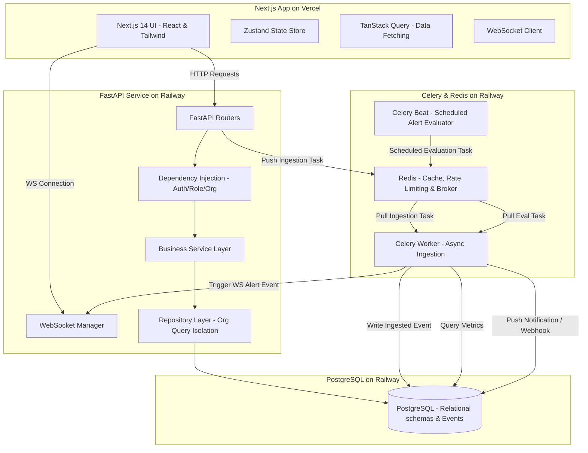

# WexaAI-Analytics: Real-Time Analytics & Reporting Platform

WexaAI-Analytics is a production-ready, multi-tenant Real-Time Analytics and Reporting SaaS platform designed for high-throughput event logging, dynamic querying, and real-time visualization dashboards (similar to a lightweight Mixpanel or Metabase).

The application features a sleek midnight-dark theme with premium glassmorphism layouts, robust user/role access layers, rolling rate limits, a background processing pipeline using Celery + Redis, WebSocket logs terminal, and real-time threshold alert rules evaluators.

---

##  Architecture & Stack Blueprint



### Technology Matrix
* **Frontend**: Next.js 14 (App Router), React, Zustand State Management, Recharts, TailwindCSS, Lucide-React, TanStack Query (v5).
* **Backend**: FastAPI (Python 3.11+), SQLAlchemy 2.0 (Async), Asyncpg driver, Celery, Redis Broker, Pydantic v2.
* **Databases**: PostgreSQL (Relational schema + JSONB logging), Redis (Caching + rolling 1000 requests/minute rate-limiter).
* **Orchestration & Testing**: Docker Compose (turnkey local deployment), Pytest (Pytest-asyncio + Async HTTPX clients + sqlite testing).

---

##  Repository Directory Layout

```text
wx-work/
├── backend/
│   ├── app/
│   │   ├── models/          # SQLAlchemy Async DB Models
│   │   ├── schemas/         # Pydantic v2 data serialization
│   │   ├── repositories/    # Query controllers (with tenant isolation filters)
│   │   ├── services/        # Business logic services (Auth, Events, WebSockets, Alerts)
│   │   ├── routers/         # API Endpoint controllers
│   │   ├── worker/          # Celery app worker configurations and Beat tasks
│   │   ├── database.py      # SQLAlchemy connection engine & session factories
│   │   ├── config.py        # Centralized Pydantic BaseSettings
│   │   └── main.py          # FastAPI application startup & tracing middleware
│   ├── tests/               # Pytest async automation suite
│   ├── requirements.txt     # Python backend dependencies
│   └── Dockerfile           # Backend container build instructions
├── frontend/
│   ├── src/
│   │   ├── app/             # Next.js pages layout views & routes
│   │   ├── store/           # Zustand client store and axios instance
│   │   └── hooks/           # useWebSocket tunnel hook
│   ├── package.json         # Node packages
│   └── tailwind.config.ts   # Design token config
├── docker-compose.yml       # Local dev containers setup
└── .env.example             # Monorepo environment configurations template
```

---

##  Local Setup: Quick Start

Ensure you have [Docker Desktop](https://www.docker.com/products/docker-desktop/) installed on your host machine.

### 1. Launch DB and Background Services
From the workspace root directory, start the container stack:
```bash
docker-compose up --build
```
This single command spins up:
- **`postgres`** database on port `5432` (Auto-creates all tables on launch).
- **`redis`** queue on port `6379`.
- **`fastapi-backend`** REST and WebSockets API server on port `8000`.
- **`celery-worker`** parsing and bulk-ingesting files asynchronously.
- **`celery-beat`** evaluating threshold alert rules every 60 seconds.

### 2. Run the Next.js Frontend
Open a separate terminal window and navigate to the frontend directory:
```bash
cd frontend
npm install
npm run dev
```
Open [http://localhost:3000](http://localhost:3000) in your web browser. You are greeted by a fully functional landing page. You can:
1. **Register** a new account and spin up a workspace.
2. **Simulate events** directly from the main panel to watch widgets update in real-time.
3. Generate **API Keys** and run bulk **CSV Dataset Uploads** in the Ingestion menu.
4. Add **Teammates** and test invitations instantly in the Sandbox panel.
5. Setup **Alert Rules** and watch notifications fire globally inside the layout in real-time.

---

##  Running Automated Tests

To verify multi-tenancy barriers, key authorization, and event processing logic, execute the pytest suite locally.

### Setup Test Environment (One-time)
Create a Python virtual environment in the `backend` directory and install dependencies:
```bash
cd backend
python -m venv venv
# On Windows PowerShell:
.\venv\Scripts\Activate.ps1
# On Linux/macOS:
source venv/bin/activate

pip install -r requirements.txt
```

### Execute the Tests
Execute the tests using standard pytest command inside the `backend` folder:
```bash
pytest -v
```
All tests override the default databases with an isolated, asynchronous in-memory SQLite instances (`aiosqlite`) to guarantee lightning-fast runs and zero cross-test state leakage.

---
